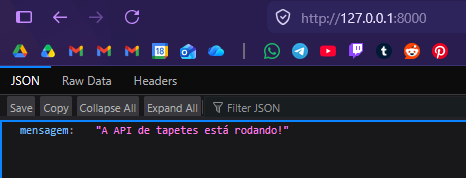
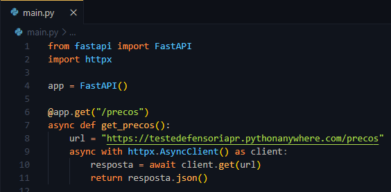

# DevLog - API de Integração Aladdin

## 1. Visão geral do desafio

- **Objetivo:** Esse projeto tem como objetivo o desenvolvimento de uma API REST em Python, projetada para servir como uma camada de integração entre sistemas internos e um serviço externo de precificação de tapetes. 
- **Problema:** Necessidade de consumir dados de uma API externa (serviço de preços de tapetes) e disponibilizá-los de forma padronizada e documentada para uso interno.
- **Solução:** Implementação de uma API utilizando o framework **FastAPI**, escolhido por sua eficiência, facilidade de documentação automática e suporte a operações assíncronas.

## 2. Processo de tomada de decisões
- Optei pelo `httpx` em vez do `requests` por ser mais moderno e assíncrono (consegue lidar com várias requisições ao mesmo tempo sem "travar" enquanto espera uma resposta), o que funciona melhor com o FastAPI, garantindo que a API Aladdin não fique bloqueada durante o consumo da API externa. 

## 3. Desafios e soluções

## 4. Organização do desafio

## 5. Sugestões de próximos passos

## 6. Passo a passo feito
### 6.1. Organização do ambiente do projeto: 

a. Eu já tinha o Python e o VS Code instalados na máquina, então não foi necessário instalar;

b. Criei um ambiente virtual controlado para o projeto, como sugestão da documentação oficial (`python -m venv venv`);

c. Instalei o FastAPI e suas dependências através do `pip install fastapi uvicorn httpx`;

d. Criei o arquivo `main.py` na pasta do projeto no VS Code (fora da pasta venv);

e. Verifiquei se tudo deu certo nas instalações e configurações rodando o código a partir da documentação oficial do FastAPI (modifiquei a mensagem de retorno para se encaixar no tema do desafio): 
`from fastapi import FastAPI`
`app = FastAPI()`
`@app.get("/")`
`def read_root():`
` return {"mensagem": "A API de tapetes está rodando!"}`

f. Iniciei o servidor local com `uvicorn main:app --reload` e verifiquei que estava funcionando;

	
g. Gerei o arquivo `requirements.txt`para registrar as dependências do projeto, garantindo que o ambiente seja reprodutível em outras máquinas;

h. Configurei o arquivo `.gitignore` na raiz do projeto para excluir a pasta `venv/` e arquivos de cache, mantendo o repositório limpo e focado apenas no código fonte.

### 6.2. Conectando a API Alladin com a API externa:

a. Para fazer esse passo, precisei consultar materiais de apoio como vídeos no Youtube , documentações oficiais e sites/blogs de programação para entender o que eu precisava organizar, consultar e fazer. Uma busca rápida no Google por "como integrar fastapi usando httpx" trouxe diversas sugestões de códigos já prontos, mas achei necessário compreender o que estava sendo realizado e não sair copiando algo pronto sem entender como funcionava de verdade. Assim, fui atrás dos materiais de apoio, que podem ser conferidos na listagem do tópico 7 (também usados em outras etapas do desenvolvimento todo). 

b. Implementei a chamada assíncrona com `httpx`;

c. Anotações sobre o que significa cada parte do código desenvolvido:

_@app.get_("/precos"): É o "endereço" da rota. Usei o `@app.get` para avisar ao FastAPI que, quando alguém acessar essa URL, essa função específica deve ser executada. 

_async def_ get_precos(): Defini a função como `async` para que ela não "trave" a aplicação. Como a API precisa consultar um serviço externo, isso permite que o sistema continue respondendo a outros usuários enquanto espera a resposta da loja de tapetes.

_await_: Usei para pausar a função apenas no momento da requisição. O código "espera" a resposta da API externa chegar sem derrubar ou bloquear todo o servidor.

_return resposta.json()_: Aqui, converto o dado recebido para JSON. O FastAPI facilita muito esse processo, pegando o dicionário Python e devolvendo automaticamente no formato que sistemas internos esperam (JSON).
	

### 6.3: Subindo o projeto para o GitHub (fim do dia 01)
**Configuração do repositório**: Inicializei o projeto local como um repositório Git, conectando-o ao GitHub Desktop para controle de versão.

**Boas Práticas de versionamento**: Já havia configurado o arquivo `.gitignore` em outra etapa. Então, nesse momento adicionei a licença **MIT** ao projeto para definir claramente as permissões de uso e colaboração, seguindo padrões profissionais de código aberto.

**Fluxo de Trabalho**: O primeiro commit focou na configuração do ambiente e na implementação da rota base, garantindo um histórico claro e organizado da evolução do projeto.

**Documentação**: Estruturei o repositório com uma pasta `assets/` para organizar os prints, utilizando caminhos em markdown para garantir a legibilidade das imagens na documentação final no GitHub.

### 6.4 Implementando a Query String
Pesquisei o que era Query String e encontrei que é a parte de uma URL usada para enviar dados ou parâmetros para um servidor, geralmente localizada após um ponto de interrogação (?), sendo muito usada em buscas e filtros. Os parâmetros são definidos por um conjunto "chave=valor". 

Então, para implementar a funcionalidade de parâmetros via URL (Query String), consultei a documentação oficial do FastAPI, na seção de Query Parameters, para entender como declarar e tipar os dados recebidos na rota. Optei inicialmente por receber a data como str para manter a simplicidade na manipulação da rota, mas depois mudei para date, que permite uma validação automática pelo FastAPI (ele é quem vai verificar se o que o usuário digitou é realmente uma data válida, e, caso não seja, vai automaticamente retornar um erro). Isso garante que a API só aceite parâmetros que seguem estritamente o formato ISO-8601 (YYYY-MM-DD).

### 6.5 Adicionando o tratamento de erros (fim do dia 02)
Basicamente, a ideia é controlar a mensagem que a API mostra ao cliente caso a API externa caia. Para isso, consultei o material de Handling Erros na documentação oficial do FastAPI e o Try/Except na documentação Python. Comecei então importando o `HTTPException`. 

Eu utilizei o try/except do Python para implementar um tratamento de erros mais robusto. Como estou consumindo um serviço externo, eu sei que ele não é 100% confiável (pode cair, dar problema etc). O _try_ isola a tentativa de requisição, e o _except_ permite que eu capture erros, devolvendo uma resposta tratada com HTTPException em vez de deixar a aplicação travar, encerrar ou exibir um erro genérico.

Coloquei o timeout de 10 segundos para que o httpx não fique tentando se conectar para sempre. Optei por um valor maior para oferecer mais tolerância a variações de latência do serviço de terceiros. O uso do `raise_for_status()` se deu para que o programa não continue de forma silenciosa quando algo está dando errado, executando assim o bloco try/except para tratar a falha de forma adequada. 

Verifiquei que, ao enviar uma data malformada (ex: 2026-13-45), a API intercepta a requisição e retorna um erro. 

### 6.6 Adicionando validação de integridade
O que acontece se, em determinado dia, a lista de preços estiver vazia? É importante ter uma mensagem de erro que especifique isso, então optei por construir essa mensagem. Como não consegui testar uma data específica para verificar se havia uma lista de preços vazia, optei por "forçar" o erro com um True statement (`if True: raise HTTPException (status_code=404, detail="Nenhum preço encontrado...")`) e deu certo. 

### 6.7 Documentação Swagger
Acessei o destino http://127.0.0.1:8000/docs para verificar a interface que aparecia a partir do FastAPI, que já gera o Swagger UI automaticamente. Essa ferramenta facilita a compreensão dos endpoints e permite testes rápidos, servindo como uma documentação sempre atualizada do projeto.

### 6.8 Adicionando Type Hints
Já havia especificado o tipo date em `data: date`. 
Adicionado `-> dict:`

### 6.9 Elaboração do README
Elaboração do README. 

#### 7. Material consultado durante o desenvolvimento
**Youtube:**
1. Como integrar com uma API na PRÁTICA? (https://www.youtube.com/watch?v=Bi5HsQz-87A)
2. HTTPX Tutorial - A next-generation HTTP client for Python (https://www.youtube.com/watch?v=qAh5dDODJ5k)
3. Best Practice to Make HTTP Request in FastAPI Application (https://www.youtube.com/watch?v=row-SdNdHFE)

**Documentações oficiais:**
FastAPI (https://fastapi.tiangolo.com/pt/tutorial/) 
HTTPX (https://www.python-httpx.org/)
Python (https://docs.python.org/3/tutorial/errors.html)

**Sites/blogs:**
1. Requests vs. HTTPX vs. AIOHTTP: comparação detalhada (https://brightdata.com.br/blog/dados-do-site/requests-vs-httpx-vs-aiohttp)
2. Python Try Except (https://www.w3schools.com/Python/python_try_except.asp)
